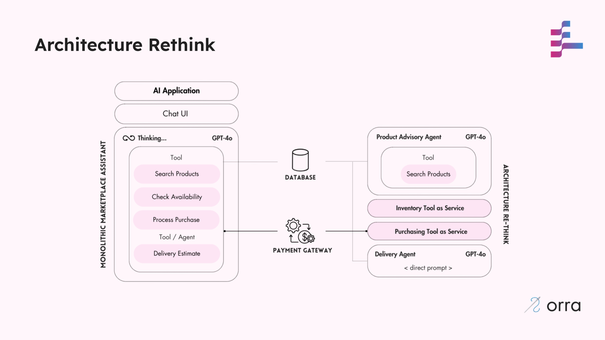

# Stage 1: Architecture Re-think with orra

In this stage, we address the key challenges in our Marketplace Assistant:
- High latency and token usage due to monolithic design
- Poor separation of concerns
- Sequential processing of tasks
- Cost inefficiency for deterministic operations

## What Changed

We've transformed our application in two significant ways (with orra's Plan Engine driving coordination and reliability).



### 1. Split the Monolith into Specialized Components

First, we divided the monolithic assistant into four specialized components:

1. **Product Advisor Agent**: An LLM-powered agent that understands complex user needs and recommends products
2. **Inventory Tool as Service**: Checks real-time product availability, and reserves/releases product stock
3. **Purchasing Tool as Service**: Handles product purchase processing for users
4. **Delivery Agent**: Uses real-time data to estimate delivery times

### 2. Migrated Tool Calls to Dedicated Services

We made a critical architectural improvement by migrating the monolith's function/tool calls to dedicated services:

- **Tool Calls in Monolith**: The original design used LLM function calling for all operations, even simple deterministic ones like inventory operations and purchase processing
- **Tools as Services**: We extracted these tool functions into proper standalone services that can be directly coordinated

This creates a clear distinction between:

- **Agents** (LLM-powered): For tasks requiring complex reasoning and human-like responses
- **(Tools as) Services** (Deterministic): For predictable operations with consistent input/output patterns

We converted these tool functions into dedicated services:
- **Inventory**: Directly handles inventory operations (previously a function call)
- **Purchasing**: Handles purchase processing including creating orders, making payments and notifying users (previously a function call)

We kept the Product Advisor and Delivery as LLM-powered agents since they benefit from complex reasoning capabilities.

This architectural shift is enabled by orra's Plan Engine, which operates at the application level rather than just the agent level. This higher-level orchestration allows direct coordination between services, eliminating the need to tunnel all interactions through LLM function-calling. The Plan Engine understands and coordinates the entire workflow across both LLM-powered agents and deterministic services.  

## Run this stage

### Prerequisites
- Node.js (v18+)
- orra [Plan Engine running and CLI installed](https://github.com/orra-dev/orra/tree/main#installation)
- [OpenAI API key](https://platform.openai.com/docs/api-reference/authentication)

### Setup & Run

1. **Initialize orra configuration**
   ```bash
   ./stage_setup.sh  # Sets up project, webhooks, and API keys

2. **Configure OpenAI API key in each component's `.env` file**
   ```shell
   OPENAI_API_KEY=your_openai_api_key_here
   ```
3. **Start each component (in separate terminals)**
   ```shell
   cd [component-directory]  # Run for each component
   npm install
   npm start
   ```
4. **Start webhook simulator (in a separate terminal)**
   ```bash
   orra verify webhooks start http://localhost:3000/webhook
   ```
### Using the Application

Let's run the expected AI Marketplace Assistant interactions [described here](../README.md#example-user-interaction). 

We'll be using the [CLI](https://github.com/orra-dev/orra/blob/main/docs/cli.md)'s `orra verify` command to understand how the Plan Engine is coordinating our components to complete system actions.

The assumption here is that there's a chat UI interface that forwards requests to the Plan Engine.

We use lowdb to query and update data in our [data.json](data.json) file - basically a simple JSON based DB. This data is shared against all the components.  

1. **Ask for a product recommendation**

```bash
orra verify run 'Recommend a product' \
  -d query:'I need a used laptop for college that is powerful enough for programming, under $800.'
```
[Follow these instructions](https://github.com/orra-dev/orra/blob/main/docs/cli.md#orchestration-actions) on how to inspect the orchestrated action.

In this case, you should see just the `Product Advisor Agent` only executing and dealing with this action. Any interim errors are handled by orra.   

2. **Enquire about delivery for the recommended product**

```bash
orra verify run 'Can I get it delivered by next week?' \
  -d 'productId:laptop-1' \
  -d 'userId:user-1'
```

In this case, there should be
- an inventory check to ensure the product is in-stock
- if yes, a delivery estimate is provided
- Any interim errors are handled by orra

3. **Purchase a recommended product**

```bash
orra verify run 'Purchase product' \
-d 'productId:laptop-1' \
-d 'userId:user-1'
```

In this case, there should be
- an inventory check to ensure the product is in-stock
- an inventory reserve request if the product is in-stock - this lowers the stock count
- A delivery estimate is provided
- The product is purchased - causing an order to be placed
- Any interim errors are handled by orra

Navigate to the [data.json](data.json) file to view the placed `order` in the `orders` list.

### Reset Environment

1. **Clear Plan Engine configurations and reset data**
```bash
./stage_reset.sh  # Clears configurations and data
```

2. **Stop all the running components and kill all the terminal window**

3. **Shutdown the Plan Engine**

## Benefits

1. **Reduced Latency**:
    - **orra** automatically parallelises appropriate tasks
    - Overall response time improved by ~60% - esp. after caching execution plans
    - Services respond faster than LLM-based agents (40% improvement for deterministic operations)

2. **Lower Token Usage**:
    - Specialised agents reduce token consumption by ~40%
    - Converting tool to services reduces token usage by ~80% for inventory and purchasing operations
    - Significant cost savings in production

3. **Improved Maintainability**:
    - Each component has a single responsibility
    - Easier to update, debug, and enhance individual components
    - Clear separation between reasoning and deterministic parts

4. **Better Reliability**:
    - Issues in one component don't necessarily impact others
    - Deterministic services have fewer failure modes than LLM-based agents

## How orra Helps

- **Automatic Orchestration**: orra handles the coordination between components based on the user or application's intent
- **Parallel Execution**: Where possible, orra executes non-dependent tasks in parallel
- **Service Discovery**: Components register with orra, which then routes requests appropriately
- **Seamless Integration**: orra orchestrates between agents and services without code changes
- **Execution Timeouts**: Set execution timeout duration per service/agent - works around Agents just spinning their wheels
- **High-Level Error Handling**: Retrying execution on all errors - upto 5 retries
- **Configurable Health Monitoring**: orra pauses orchestrations due to unhealthy services and resumes them when health is restored

## Next Steps

Our application is now more efficient, but it still lacks robust error handling. In the [stage 2](../stage2-consistency), we'll implement compensation mechanisms to handle failures and ensure state/transaction integrity.
