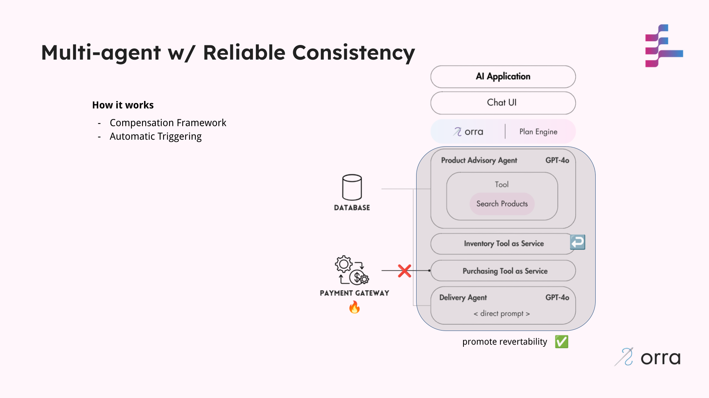

# Stage 2: Reliable Consistency with orra

In this stage, we address the critical issue of ensuring consistent state in our marketplace assistant by implementing compensation handlers for critical operations.

## The Problem: Inconsistent State

Our Stage 1 architecture had a significant reliability flaw:

1. When purchasing an item, inventory was reserved (stock reduced) BEFORE payment processing
2. If the payment failed, the inventory remained reduced, creating an inconsistent state
3. Products appeared out of stock even though they were never purchased
4. This required manual intervention to fix the inventory

This issue is particularly problematic because payment processing is inherently unreliable. Payment gateways can fail for numerous reasons, from network issues to bank verification problems. While our current implementation focuses on immediate payment failures, real-world systems must also handle delayed rejections that occur well after the initial transaction attempt.

This problem demonstrates a classic challenge in distributed systems: maintaining consistent state across services when operations can fail at any point in a transaction flow.

This stage rigs the **Purchasing Tool as Service** payment processing to **ALWAYS fail**.

## What Changed

We've implemented compensation handlers for critical operations:

**Purchasing Payment Failure Compensation**: If a payment fails during purchasing, we automatically restore inventory



## Run this stage

### Prerequisites
- Node.js (v18+)
- orra [Plan Engine running and CLI installed](https://github.com/orra-dev/orra/tree/main#installation)
- [OpenAI API key](https://platform.openai.com/docs/api-reference/authentication)

### Setup & Run

1. **Initialize orra configuration**
   ```bash
   ./stage_setup.sh  # Sets up project, webhooks, and API keys

2. **Configure OpenAI API key in each component's `.env` file**
   ```shell
   OPENAI_API_KEY=your_openai_api_key_here
   ```
3. **Start each component (in separate terminals)**
   ```shell
   cd [component-directory]  # Run for each component
   npm install
   npm start
   ```
4. **Start webhook simulator (in a separate terminal)**
   ```bash
   orra verify webhooks start http://localhost:3000/webhook
   ```
### Using the Application

In this case we just want to demonstrate how the AI Marketplace Assistant can handle payment failures in our purchasing flow.

Again, we'll be using the [CLI](https://github.com/orra-dev/orra/blob/main/docs/cli.md)'s `orra verify` command to understand how the Plan Engine is coordinating our components to complete system actions.

The assumption here is that there's a chat UI interface that forwards requests to the Plan Engine.

We use lowdb to query and update data in our [data.json](data.json) file - basically a simple JSON based DB. This data is shared against all the components.

1. **Purchase a recommended product**

```bash
orra verify run 'Purchase product' \
-d 'productId:laptop-1' \
-d 'userId:user-1'
```

In this case, there should be
- an inventory check to ensure the product is in-stock
- an inventory reserve request if the product is in-stock - this lowers the stock count
- A delivery estimate is provided
- A product purchase is attempted and fails after retries
- The reserved product is released using [orra compensations](https://github.com/orra-dev/orra/blob/main/docs/compensations.md) running the [onRevert Handler](#compensation-handler-definition). 

Navigate to the [data.json](data.json) file there should be NO placed `order` in the `orders` list.

### Reset Environment

1. **Clear Plan Engine configurations and reset data**
```bash
./stage_reset.sh  # Clears configurations and data
```

2. **Stop all the running components and kill all the terminal window**

3. **Shutdown the Plan Engine**

## Benefits

1. **Consistent State**: The system maintains data consistency even when operations fail
2. **Automatic Recovery**: No manual intervention needed to fix data issues
3. **Increased Reliability**: Users can trust that products won't disappear incorrectly
4. **Audit Trail**: Complete history of operations and compensations

## How orra Helps

- **Compensation Framework**: orra provides built-in support for defining compensation handlers
- **Automatic Triggering**: Compensation is automatically triggered when operations fail
- **Orchestration**: orra manages the complex flow of operations and compensations

## Implementation Details

### Compensation Handler Definition

Example inventory release compensation:

```javascript
// Register compensation handler for inventory reservation
inventoryService.onRevert(async (task, result) => {
   // Only process compensations for reserveProduct actions
   if (task.input.action === 'reserveProduct' && result.success) {
      // Compensation logic: release the product that was reserved
      const releaseResult = releaseProduct(result.productId, 1);
      console.log('Inventory compensation completed:', releaseResult);
   }
});
```

### Handling Compensation

1. **Begin Transaction**: orra starts tracking a transaction
2. **Register Operations**: Each operation registers potential compensation
3. **Execute Operations**: Normal flow proceeds
4. **Handle Failures**: If an operation fails, orra automatically:
    - Stops forward progress
    - Executes compensation handlers in reverse order
    - Records the compensation actions
    - Notifies appropriate services/agents

## Next Steps

While our system is now more reliable with compensation handlers, it can still allow agents to perform operations outside our business domain constraints. In [Stage 3](../stage3-grounding), we'll implement domain guardrails to prevent hallucinations and enforce business rules.
