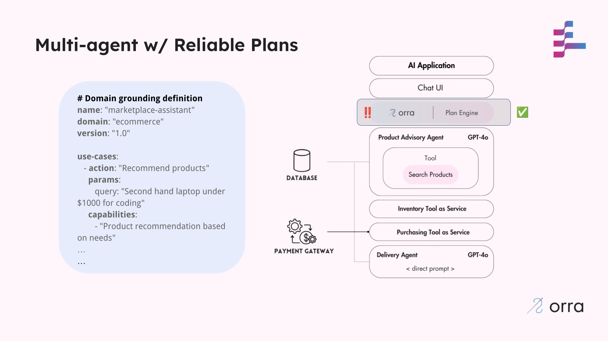

# Stage 3: Reliable Plans with orra

In this stage, we address the challenge of LLM plan hallucinations by implementing domain grounding.

## The Problem: Potential Plan Engine Hallucinations

Even with reliable compensation mechanisms, LLM-powered plan engines can still:

1. Hallucinate execution plans with non-existent services or capabilities
2. Generate plans that don't match the user's actual intent
3. Create invalid action sequences that can't be executed properly
4. Make incorrect assumptions about service capabilities
5. Design plans that require impossible state transitions

## What Changed

We've implemented domain grounding for our marketplace assistant:

1. **Use Case Definitions**: Clearly defined use cases of actions and the expected capabilities they require
2. **Semantic Verification**: The planning system ensures all actions align with real capabilities
3. **PDDL Validation**: Execution plans are formally validated before execution



## Domain Grounding Definition

See [assist-grounding.yaml](assist-grounding.yaml).

```yaml
# Domain grounding definition
name: "marketplace-assistant"
domain: "ecommerce"
version: "1.0"

use-cases:
   - action: "Recommend products"
     params:
        query: "Second hand laptop under $1000 for coding"
     capabilities:
        - "Product recommendation based on needs"
        - "Product finder based on user preferences"
     intent: "Customer wants to find products matching specific criteria"

   - action: "Purchase a product"
     params:
        productId: "laptop-1"
        userId: "user-1"
     capabilities:
        - "Inventory availability check"
        - "Inventory reserve product"
        - "Estimate delivery date"
        - "Purchase processing"
     intent: "Customer wants to purchase a specific product"

   - action: "Can I get it delivered soon?"
     params:
        productId: "laptop-1"
        userId: "user-1"
     capabilities:
        - "Inventory availability check"
        - "Delivery estimation"
     intent: "Customer wants to know potential dates for delivery"

constraints:
   - "Verify product availability before processing purchase"
   - "Provide delivery estimates based on inventory location"
```

## Run this stage

### Prerequisites
- Node.js (v18+)
- orra [Plan Engine running and CLI installed](https://github.com/orra-dev/orra/tree/main#installation)
- [OpenAI API key](https://platform.openai.com/docs/api-reference/authentication)

### Setup & Run

1. **Initialize orra configuration**
   ```bash
   ./stage_setup.sh  # Sets up project, webhooks, and API keys

2. **Configure OpenAI API key in each component's `.env` file**
   ```shell
   OPENAI_API_KEY=your_openai_api_key_here
   ```
3. **Start each component (in separate terminals)**
   ```shell
   cd [component-directory]  # Run for each component
   npm install
   npm start
   ```
4. **Start webhook simulator (in a separate terminal)**
   ```bash
   orra verify webhooks start http://localhost:3000/webhook
   ```
### Using the Application

In this case we just want to demonstrate how grounding works.

Again, we'll be using the [CLI](https://github.com/orra-dev/orra/blob/main/docs/cli.md)'s `orra verify` command to understand how the Plan Engine is coordinating our components to complete system actions.

The assumption here is that there's a chat UI interface that forwards requests to the Plan Engine.

1. **Apply the grounding**

```bash
orra grounding apply -f stage3-grounding/assist-grounding.yaml
```

2. **Ensure the domain is locked**

```bash
orra verify run 'Refund  product' \
-d 'productId:laptop-1' \
-d 'userId:user-1'
```

This should be rejected.

3. **Purchase a recommended product - with grounding**

```bash
orra verify run 'Purchase product' \
-d 'productId:laptop-1' \
-d 'userId:user-1'
```

Now extra checks are enforced to stop Plan Hallucinations and impossible state transitions are guarded against.

Invalid plans will NEVER run. 

### Reset Environment

1. **Clear Plan Engine configurations and reset data**
```bash
./stage_reset.sh  # Clears configurations and data
```

2. **Stop all the running components and kill all the terminal window**

3. **Shutdown the Plan Engine**

## Benefits

1. **Reduced Plan Hallucinations**: The plan engine cannot generate invalid execution plans
2. **Stronger Reliability**: All plans are grounded in real service capabilities
3. **Consistent Execution**: Plans align with well-defined use cases
4. **Clear Intent Mapping**: User requests map to verified execution patterns
5. **Formal Validation**: PDDL validation ensures logical correctness of plans

## How orra Helps

- **Plan Engine**: Validates all execution plans against domain grounding
- **Embedding-based Matching**: Intelligently maps user intents to grounded use cases
- **PDDL Validation**: Ensures plans satisfy logical constraints and capabilities

## Plan Validation Process

1. **User Request Processing**:
    - The system receives a user request
    - The request is analyzed to determine the user's intent

2. **Plan Generation**:
    - The Plan Engine generates an initial execution plan
    - The plan is based on the available services and capabilities

3. **Grounding Validation**:
    - The plan is checked against domain grounding examples
    - Both semantic matching and formal PDDL validation are performed
    - The system verifies capability requirements and execution constraints

4. **Execution or Rejection**:
    - Valid plans are executed
    - Invalid plans are rejected

## Hallucination Prevention Example

Consider this scenario:

1. **User Request**: "I want to cancel my order and get a refund"
2. **Without Grounding**: The plan engine might hallucinate a non-existent "refund-service" in the plan
3. **With Grounding**: The plan is validated against known capabilities and rejected, with the system explaining, "I'm sorry, but our system doesn't currently support order cancellations and refunds"

## Done

Our application is now more reliable with grounded planning!
